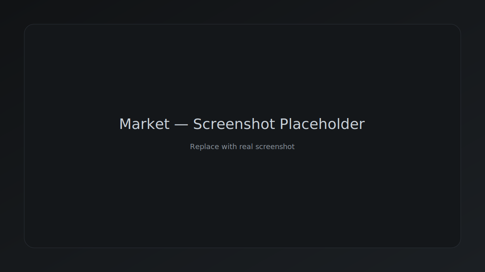
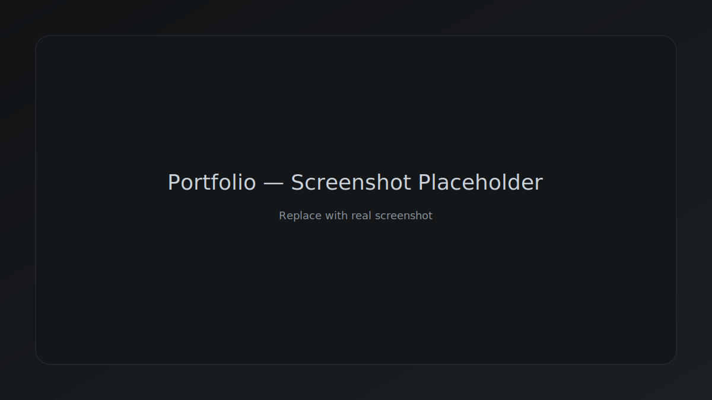
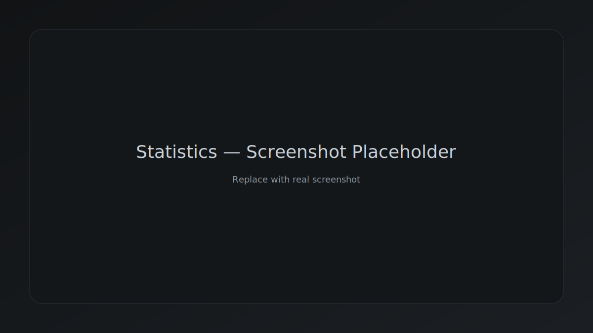

# Crypto Simulator


Симулятор торговли криптовалютой с портфелем, статистикой и визуальными графиками. Проект построен на React + TypeScript + Vite, с упором на UI/UX, доступность и адаптивность.

**Основные возможности**
- Рынок: отображение цен и выбор актива.
- Торговля: покупка/продажа, кнопка сброса симуляции.
- Портфель: распределение активов, прибыль/убыток.
- Статистика: история операций и фильтрация.
- Темы: светлая/тёмная, сохранение в localStorage.
- Адаптив: корректная работа на мобильных и в landscape.

## Скриншоты





## Быстрый старт

```bash
npm install
npm run dev
```

Приложение поднимется локально. Конфигурация API берётся из переменной окружения `VITE_API_URL`.

## Переменные окружения

Создайте `.env` (пример):

```bash
VITE_API_URL=https://api.coingecko.com/api/v3
```

Используются эндпоинты:
- `/simple/price`
- `/coins/{id}/market_chart`

Подходит любой API с аналогичной схемой.

## Скрипты

```bash
npm run dev      # запуск в режиме разработки
npm run build    # production сборка
npm run preview  # локальный предпросмотр сборки
npm run lint     # eslint
npm run deploy   # деплой на gh-pages
```

## Деплой на GitHub Pages

В `vite.config.ts` уже установлен `base: "/crypto-dashboard/"`.  
Если репозиторий называется иначе, поменяйте `base`.

```bash
npm run build
npm run deploy
```

## Структура проекта

```
src/
  api/            # запросы к API
  components/     # UI компоненты
  constants/      # константы и конфиги
  helpers/        # утилиты
  hooks/          # кастомные хуки
  layout/         # общий layout
  pages/          # страницы
  store/          # Zustand сторы
  types/          # типы
```

## Доступность и UX

- Dialog с focus-trap и закрытием по `Esc`.
- Клавиатурная навигация в кастомных селектах.
- `aria-live` для Snackbar.
- Увеличенные tap-зоны на мобильных.

## Производительность

- Разбиение бандла на чанки (React, charts, state, vendor).
- Оптимизированные стили и фон.

## Лицензия

Все права защищены.

## Roadmap

- Ленивая загрузка графиков.
- Экспорт/импорт истории операций.
- Тонкая настройка темы (контраст, насыщенность).

## Changelog

- Улучшен UI/UX и мобильная адаптация.
- Добавлена доступность для ключевых компонентов.
- Разбиение бандла на чанки для ускорения загрузки.
